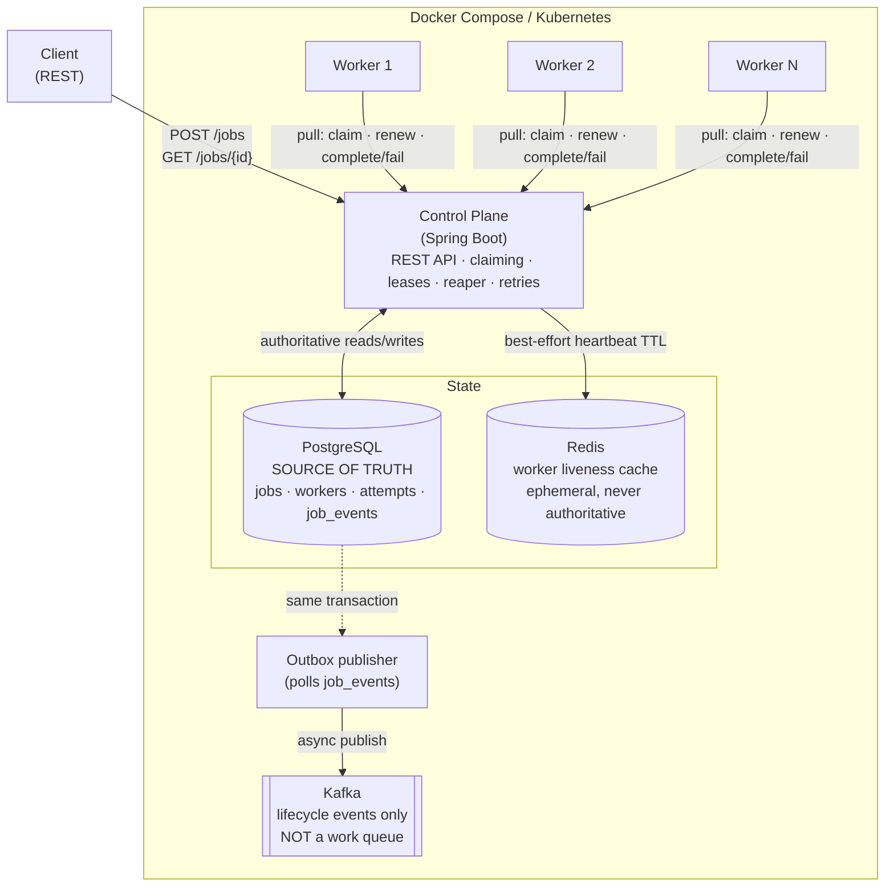
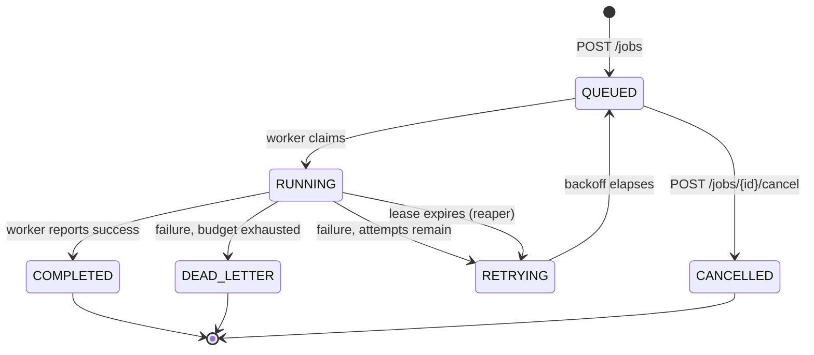

# TaskMesh

A distributed job scheduling platform built on Java 21, Spring Boot, PostgreSQL, Redis and Kafka, deployable with Docker Compose or Kubernetes. Clients submit jobs over a REST API; a pool of horizontally scalable workers pulls work from a control plane, executes it under a lease, and reports the outcome. The system survives worker crashes, retries transient failures with exponential backoff, dead-letters jobs that exhaust their attempt budget, and keeps running through Redis and Kafka outages — because PostgreSQL is the only component that is ever authoritative about job state.

## Why this exists

Running background work reliably across several machines forces a specific set of problems into the open, and they are the problems this project is about:

- **Two workers must never run the same job concurrently** — even though both are polling the same queue at the same instant.
- **A worker can die mid-job**, and the system must notice and recover the work without a human.
- **A worker can appear to die and then come back** — a GC pause, a network partition — and must not be allowed to corrupt state when it does.
- **Failures must be retried, but not forever.**
- **Other systems want to know what happened**, without coupling job execution to a message broker being up.

TaskMesh solves these with well-understood mechanisms — atomic claiming via row locks, leases with fencing tokens, a transactional outbox — rather than by adding infrastructure.

## Architecture



Workers hold **no** database, Redis or Kafka client. They talk HTTP to the control plane and nothing else, so the control plane owns all state transitions.

## Core design decisions

| Decision | Rationale |
|---|---|
| **PostgreSQL is the source of truth** | Job state, worker registry, attempt history and the event outbox all live in one transactional store, so a state change and its audit record can never disagree. |
| **Workers pull, they are not pushed to** | A worker claims work only when it has capacity. Backpressure is automatic, scaling is just adding replicas, and the control plane needs no knowledge of worker health to route work. |
| **Atomic claiming with `FOR UPDATE SKIP LOCKED`** | Makes concurrent claiming correct without a distributed lock or a leader. |
| **Leases, not heartbeat-based ownership** | A claim grants time-bounded ownership. If a worker dies, its lease simply lapses — no consensus needed to declare it dead. |
| **Fencing with `current_execution_id`** | A resurrected worker cannot report on a job that has moved on without it. |
| **Retries with exponential backoff** | Transient failures recover on their own; a capped attempt budget stops infinite loops. |
| **Dead-lettering** | Jobs that exhaust their budget stop consuming capacity and become visible for inspection. |
| **Transactional outbox** | Events are committed with the state change, then published asynchronously — so a Kafka outage cannot block or corrupt job processing. |
| **Redis has one narrow job** | Worker liveness, as a TTL cache. Nothing in the claim path reads it. |
| **Kafka has one narrow job** | Lifecycle event publication for downstream consumers. It is never a work queue. |
| **The database clock decides scheduling** | `scheduled_at <= now()` and lease expiry are evaluated by PostgreSQL. A JVM with a skewed clock cannot make a job eligible early (JVM clocks were measured ~35ms ahead locally). |

## Job lifecycle



The four paths in words:

- `QUEUED → RUNNING → COMPLETED` — the normal case.
- `RUNNING → RETRYING → QUEUED` — a failure with attempts remaining; `RETRYING` holds the job until its backoff elapses.
- `RETRYING → DEAD_LETTER` — the attempt budget is exhausted.
- `QUEUED → CANCELLED` — cancellation is only possible before a worker claims the job. Cancelling a `RUNNING` job is deliberately **not** supported.

## Concurrency model

Claiming happens inside one PostgreSQL transaction:

```sql
SELECT * FROM jobs
 WHERE status = 'QUEUED'
   AND scheduled_at <= now()
 ORDER BY priority DESC, scheduled_at ASC, id ASC
 LIMIT :limit
 FOR UPDATE SKIP LOCKED
```

`FOR UPDATE` locks each selected row until the transaction commits. `SKIP LOCKED` is what makes concurrent claiming work: rather than blocking on a row another transaction already holds, the query steps over it and takes the next eligible one. Two workers claiming at the same instant therefore walk away with **different** jobs, and the loser of a race is never handed a row the winner is about to move out of `QUEUED`.

Ordering is `priority DESC, scheduled_at ASC, id ASC` — highest priority first, oldest first within a priority, with the job id as a deterministic tie-breaker.

## Lease and fencing model

- On claim, the job gets `lease_until = now() + 30s` and a freshly generated `current_execution_id` (the fencing token).
- The worker renews every **10s**, giving three chances before a lease lapses.
- A **reaper** runs every second and finds `RUNNING` jobs whose `lease_until` has passed, treating them as abandoned: the job goes to `RETRYING` (or `DEAD_LETTER`) and is reassigned under a **new** execution id.
- Every worker write (`renew`, `complete`, `fail`) must present the current execution id. If it does not, the control plane answers **`409 STALE_EXECUTION`**.

This is what makes crash recovery safe. When a worker is reassigned work, the old execution id is permanently dead — so a zombie worker that wakes up after a pause and reports success is rejected rather than being allowed to mark a job complete that another worker is actively running.

## Retry model

- `attempt_count` increments per execution; `max_attempts` (default 3) bounds it.
- Failure with attempts remaining → `RETRYING`, with `scheduled_at` pushed out by exponential backoff (1s, 2s, 4s…, capped at 60s), then back to `QUEUED`.
- Failure with no attempts remaining → `DEAD_LETTER`, with `last_failure_reason` retained.
- A lease expiry is treated as a failed attempt, so a crash-looping worker cannot retry a job forever.

## Transactional outbox

Every state transition writes its event row into `job_events` **in the same transaction as the state change itself**. The two commit together or roll back together, so there is no window in which a job is `COMPLETED` but its event was lost, or an event claims a transition that was rolled back.

A separate scheduled publisher polls unpublished rows, sends them to Kafka, and stamps `published_at`. This yields **at-least-once** delivery: a crash between send and stamp republishes the event. Consumers must therefore be idempotent — events carry a stable `BIGSERIAL` id for deduplication.

Because publication is decoupled, a Kafka outage delays events but never blocks a job.

## Failure handling

| Failure | Behavior |
|---|---|
| **Worker crashes mid-job** | Its lease lapses; the reaper moves the job to `RETRYING` and another worker claims it under a new execution id. |
| **Lease expires** | Treated as a failed attempt — consumes the attempt budget and can eventually dead-letter. |
| **Stale worker reports completion** | Rejected with `409 STALE_EXECUTION`; job state is untouched. |
| **Job repeatedly fails** | Backs off exponentially, then `DEAD_LETTER` once `max_attempts` is reached. |
| **Redis goes down** | Degraded, not broken. Registration, heartbeats, claiming, leases and completion all keep working; liveness lookups return "not alive" instead of failing. Redis operations fail in ~1s rather than blocking. |
| **Kafka goes down** | Job processing is unaffected. Events accumulate unpublished in `job_events` and drain automatically when the broker returns. |
| **Control plane restarts** | Workers retry registration on their own; in-flight leases lapse and are reaped normally. |

Two configuration details make the Redis and Kafka behavior real rather than theoretical:

- **Timeouts.** Lettuce defaults to a **60-second** command timeout, so without `spring.data.redis.timeout=1s` an unreachable Redis makes every call *block* for a minute before the error handling runs. Handling a failure is not the same as failing fast.
- **Scheduler pool sizing.** Spring's default scheduler pool is **one thread**. With it, a single blocked task stops every other scheduled task in the process — a blocked heartbeat was enough to stop a worker claiming work entirely. Pools are sized to the number of `@Scheduled` methods in each process (control plane 3, worker 4).

## Kubernetes

Manifests live in [`k8s/`](k8s/) and are applied in filename order:

| File | Contents |
|---|---|
| `00-namespace.yaml` | `taskmesh` namespace |
| `01-config.yaml` | ConfigMap (service DNS names) + Secret (local dev credentials) |
| `10-postgres.yaml` | PVC + Deployment + Service |
| `11-redis.yaml` | Deployment + Service (no PVC — it is a cache) |
| `12-kafka.yaml` | PVC + Deployment + Service (KRaft, single node) |
| `20-control-plane.yaml` | Deployment + Service, probes, `wait-for-postgres` init container |
| `21-worker.yaml` | Deployment, 2 replicas, no Service |

**Worker identity** comes from the downward API — each pod's `metadata.name` is injected as `WORKER_ID`, so every replica registers under its own pod name and identities stay unique across scaling and restarts.

```bash
kubectl apply -f k8s/
kubectl -n taskmesh wait --for=condition=available --timeout=300s deploy --all
kubectl -n taskmesh get pods

# Scale workers
kubectl -n taskmesh scale deploy/taskmesh-worker --replicas=3

# Reach the API
kubectl -n taskmesh port-forward svc/control-plane 8080:8080

# Inspect
kubectl -n taskmesh logs -l app=taskmesh-worker --tail=50
kubectl -n taskmesh delete namespace taskmesh   # also removes the PVCs
```

Probe semantics are deliberate: **liveness** includes only `livenessState`, so a Redis or Kafka outage can never trigger a restart loop; **readiness** includes `db`, because PostgreSQL is the one dependency the API genuinely cannot serve without.

See [`docs/day6-kubernetes.md`](docs/day6-kubernetes.md) for detail.

## Local development

Prerequisites: JDK 21, Docker (with Compose v2). The Maven wrapper is committed, so no local Maven is needed.

```bash
# Build and run the full test suite (uses Testcontainers, so Docker must be running)
./mvnw clean verify

# Start the whole stack: PostgreSQL, Redis, Kafka, control plane, 1 worker
docker compose up --build

# Run several competing workers
docker compose up --build --scale worker=3

# Stop and remove volumes
docker compose down -v
```

The control plane listens on **`localhost:8080`**.

### API

| Method | Path | Purpose |
|---|---|---|
| `POST` | `/jobs` | Submit a job — `201` created, `200` idempotent replay, `409` idempotency conflict |
| `GET` | `/jobs/{id}` | Fetch job state |
| `POST` | `/jobs/{id}/cancel` | Cancel a `QUEUED` job |
| `POST` | `/internal/workers/register` | Worker registration (upsert) |
| `POST` | `/internal/workers/{id}/heartbeat` | Liveness |
| `POST` | `/internal/workers/{id}/claim` | Claim one job — `204` when none eligible |
| `POST` | `/internal/workers/{id}/deregister` | Graceful departure |
| `POST` | `/internal/jobs/{id}/lease/renew` | Extend the lease |
| `POST` | `/internal/jobs/{id}/complete` | Report success |
| `POST` | `/internal/jobs/{id}/fail` | Report failure |

The `/internal/*` endpoints are the worker protocol. There is no list-jobs endpoint — query PostgreSQL directly for bulk inspection.

```bash
# Submit
curl -X POST localhost:8080/jobs -H 'Content-Type: application/json' \
  -d '{"idempotencyKey":"demo-1","type":"TEST_JOB","payload":{"n":1},"priority":5,"maxAttempts":3}'

# Check
curl localhost:8080/jobs/<id>
```

### Observability

Actuator is exposed at `/actuator` with `health`, `info` and `metrics` only (deliberately not `*`):

```bash
curl localhost:8080/actuator/health/readiness
curl localhost:8080/actuator/metrics/taskmesh.jobs.completed
```

Twelve application metrics are published, including `taskmesh.jobs.submitted/claimed/completed/cancelled`, `taskmesh.jobs.failed` (tagged `outcome=retry|dead_letter`), `taskmesh.leases.expired`, `taskmesh.executions.stale_rejected`, `taskmesh.outbox.published/publish_failures`, a `taskmesh.jobs.claim` timer, and gauges for active workers and pending outbox depth. Tags are kept low-cardinality on purpose — no job ids or worker ids as tag values.

## Testing

**101 tests, 0 failures, 0 errors, 0 skipped** (`./mvnw clean verify`). Integration tests run against real PostgreSQL, Redis and Kafka via Testcontainers — there are no mocked datastores.

| Test class | Tests | Covers |
|---|---:|---|
| `OutboxTests` | 19 | Outbox atomicity, ordering, publication, `published_at` stamping |
| `ExecutionReliabilityTests` | 19 | Leases, renewal, fencing, reaper, reassignment, race conditions |
| `RetryAndDeadLetterTests` | 15 | Attempt counting, backoff, dead-lettering |
| `JobApiTests` | 13 | REST contract, validation, idempotency, cancellation |
| `JobClaimTests` | 11 | Atomic claiming, priority ordering, concurrent claim safety |
| `WorkerApiTests` | 9 | Registration, heartbeat, deregistration |
| `RedisOutageAndSchedulerTests` | 6 | Redis outage degradation, fail-fast timing, scheduler isolation |
| `PayloadHasherTest` | 4 | Idempotency payload hashing |
| `OutboxKafkaOutageTests` | 3 | Kafka outage — events accumulate and drain |
| Application context tests | 2 | Control plane and worker start |

Concurrency is tested with real parallel threads against a real database, not simulated.

## Known limitations

These are deliberate scope decisions for a 7-day project, not oversights:

- **At-least-once execution, not exactly-once.** A worker can complete a job and die before reporting it; the lease lapses and the job is re-run. Job handlers must be idempotent. Exactly-once is not offered and is not achievable this way.
- **At-least-once event delivery.** The outbox can republish an event after a crash between send and stamp. Consumers must deduplicate on the event id.
- **No authentication or authorization.** The API is entirely open, including `/internal/*`. Suitable for a trusted network only.
- **No TLS** anywhere.
- **Credentials are committed** in `docker-compose.yml` and `k8s/01-config.yaml` as plain local-development values. A real deployment would source them from a secret manager.
- **Running jobs cannot be cancelled** — only `QUEUED` ones.
- **No recurring or cron schedules**; `scheduledAt` sets a one-off future time only.
- **No DAGs or job dependencies.**
- **No multi-tenancy.**
- **Single-node Kafka and single-replica PostgreSQL** — no HA for the datastores themselves.
- **The control plane is stateless and scales horizontally, but has not been load-tested** at multiple replicas.
- **The worker's `doWork()` is a stand-in** (a sleep). There is no pluggable executor registry.
- **No dead-letter requeue endpoint** — dead-lettered jobs are terminal and must be inspected in the database.
- **No admin or list-jobs API.**

## Project layout

```
taskmesh-common/          Shared worker-protocol DTOs
taskmesh-control-plane/   REST API, claiming, leases, reaper, retries, outbox
taskmesh-worker/          Pull-model worker runtime
docker/                   Dockerfiles for both services
k8s/                      Kubernetes manifests
docs/                     Kubernetes guide and demo runbook
```
